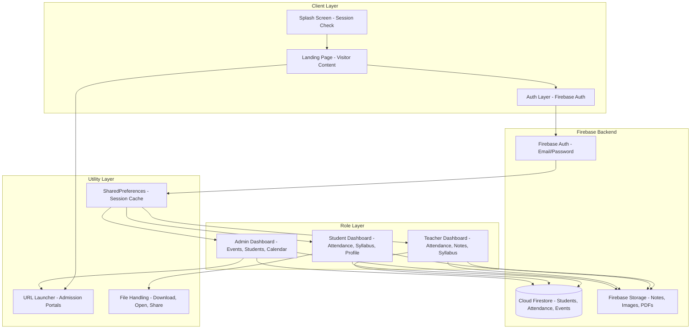

<p align="center">
  
</p>

<h1 align="center">College Management App</h1>

<p align="center">
  <strong>Role-based academic management platform for RMC (Reena Mehta College)</strong>
</p>

<p align="center">
  <a href="#overview">Overview</a> · 
  <a href="#architecture">Architecture</a> · 
  <a href="#features">Features</a> · 
  <a href="#screenshots">Screenshots</a> · 
  <a href="#tech-stack">Tech Stack</a> · 
  <a href="#project-structure">Structure</a> · 
  <a href="#quick-start">Quick Start</a>
</p>

<br/>

---

## Overview

College Management App consolidates fragmented academic workflows—attendance tracking, syllabus distribution, event management, document sharing, and admissions—into a single mobile interface with **role-aware access control**.

The app serves four distinct user categories—visitors, students, teachers, and administrators—each with a tailored view into the same institutional data layer. Rather than maintaining separate portals for each function (attendance in one system, syllabus in another, events in a third), the platform unifies them under a shared Firebase backend.

**Why this exists:** Academic institutions typically run 3-5 disconnected systems (attendance software, syllabus PDFs, event notice boards, admission portals, calendar apps). This app eliminates that fragmentation by providing a single authenticated entry point that routes each user to the tools and data they need.

<br/>

### Who It Serves

| Role | Access Scope | Primary Actions |
|:-----|:-------------|:----------------|
| **Visitor** | Public | View admissions info, course catalog, institutional pages |
| **Student** | Personal | Track attendance, view syllabus, access notes, events, calendar |
| **Teacher** | Assigned cohorts | Mark attendance, upload syllabus/notes, manage students |
| **Admin** | Full system | Manage events, oversee students/teachers, bulk operations |

<br/>

## Architecture

The application follows a **three-tier role-based architecture** with Firebase as the shared backend infrastructure.



### Data Flow

```
User Action -> Widget -> Firestore SDK -> Authentication Check -> 
Query/Write -> Real-time Snapshot -> State Update -> UI Rebuild
```

All data access is gated through Firebase Auth. On login success, the app reads the user's stored role from SharedPreferences and routes to the appropriate dashboard. Firestore's snapshot listener ensures real-time updates across all connected clients—when a teacher marks attendance, the student dashboard reflects the change immediately.

### Session Management

The splash screen implements a **5-day session expiry** system:

```
App Start -> Check SharedPreferences for cached session
  Session valid (< 5 days) -> Route to role dashboard
  Session expired (>= 5 days) -> Clear cached tokens -> Show login
```

This balances convenience (users aren't constantly re-authenticating) with security (stale sessions are periodically invalidated).

<br/>

## Features

### Authentication & Role Routing

- Email/password authentication via Firebase Auth
- Role detection from Firestore user data
- 5-day cached session with automatic expiry
- Role-specific dashboard routing (Admin, Teacher, Student)

### Admin Panel

| Feature | Implementation | Value |
|:--------|:---------------|:------|
| Event Management | Firestore CRUD with timestamps | Centralized notice system |
| Student Directory | Stream/year filtering with real-time search | Instant cohort lookup |
| Teacher Management | Dedicated add/manage flow | Reduces IT overhead |
| Academic Calendar | Integrated calendar view | Unified scheduling |
| Bulk Delete | Multi-select + batch Firestore delete | Efficient cleanup |
| Gradient UI | Custom app bar with animated title transitions | Polished admin experience |

### Teacher Panel

| Feature | Implementation | Value |
|:--------|:---------------|:------|
| Attendance Marking | Per-student lecture tracking with type (Theory/Practical) | Granular attendance records |
| Notes Upload | Firebase Storage + image_picker | Digital resource distribution |
| Syllabus Management | Stream/year-specific syllabus CRUD | Structured curriculum delivery |
| Student Management | Searchable lists by stream + year | Quick cohort access |
| Expandable FAB | Animated 3-button action menu with scale transitions | Clean UI, fast actions |
| Dashboard | Bottom nav with schedule + profile views | Dual-view efficiency |

### Student Panel

| Feature | Implementation | Value |
|:--------|:---------------|:------|
| Attendance Dashboard | Real-time Theory/Practical/Overall percentages with fl_chart | Visual attendance insight |
| Syllabus Viewer | Stream/year-specific syllabus content | Always-accessible curriculum |
| Notes Downloader | Firebase Storage + flutter_downloader + open_file | Offline resource access |
| Profile Section | Personal info + session management | Self-service account |
| College Events | Real-time Firestore event feed | Stay informed |
| Academic Calendar | Integrated calendar view | Schedule planning |
| Timetable | Stream/year timetable viewer | Daily schedule access |
| Bottom Navigation | 4-tab with gradient active states | Intuitive navigation |

### Visitor / Landing Page

| Feature | Implementation | Value |
|:--------|:---------------|:------|
| Auto-Sliding Carousel | Custom PageView with auto-scroll | Dynamic content showcase |
| Admission Portals | Direct links via url_launcher | One-tap application access |
| Course Catalog | Programs, stream codes, university links | Complete academic info |
| Institutional Pages | 20+ pages (About, Facilities, Placement, NSS, etc.) | Full college information |
| Drawer Navigation | Comprehensive section navigation | Easy content discovery |
| Contact & Queries | Direct call link for admission support | Immediate assistance |

### Institutional Content Pages

The app includes **20+ static content pages** covering the full institutional information suite:

```
About Us | Alumni Committee | Alumni Testimonials | Awards of Principal
Code of Conduct | College Development | Examination Committee
Examination Scheme | Facilities | Feedback Forms | IQAC Committee
Library | Merit Lists | NSS Unit | Placement | Policy & Procedures | RTI
Sample Feedback Forms | Skill Development Program
Student Satisfaction Survey | Students' Corner
```

These pages are built using a modular component system (14 reusable widgets) that ensures visual consistency across the entire information architecture.

<br/>

## Screenshots

> **Gallery coming soon.** Screenshots will be added after the next release.

To capture the best screenshots for this README, run the app and capture these screens:

1. **Landing Page** — The auto-sliding carousel with admission buttons visible (portrait, full page)
2. **Admin Dashboard** — The event list with the gradient app bar and FAB visible
3. **Teacher Panel** — The expandable FAB open state showing Add Attendance, Add Notes, Add Syllabus
4. **Student Dashboard** — The attendance analytics screen showing Theory/Practical/Overall percentages
5. **Syllabus Viewer** — A stream-specific syllabus screen showing structured content
6. **Drawer Navigation** — The expanded navigation drawer showing the content hierarchy

Upload screenshots to the `assets/` directory and reference them with `raw.githubusercontent.com` paths.

<br/>

## Tech Stack

| Category | Technology | Purpose |
|:---------|:-----------|:--------|
| **Core** | Flutter 3.7+ | Cross-platform UI framework |
| | Dart 3.7+ | Application language |
| **Backend** | Firebase Auth | Email/password authentication + role mapping |
| | Cloud Firestore | Real-time document database |
| | Firebase Storage | File storage for notes, images, PDFs |
| **State & Data** | SharedPreferences | Session caching with 5-day expiry |
| | Dio | HTTP client for downloads |
| | path_provider | Local file path resolution |
| | flutter_downloader | Background file download management |
| **UI** | fl_chart | Attendance percentage visualization |
| | table_calendar | Academic calendar views |
| | photo_view / video_player | Media viewing (images, videos) |
| **Utilities** | url_launcher | External portal navigation |
| | image_picker | Camera/gallery media selection |
| | permission_handler | Runtime permission management |

<br/>

## Project Structure

```
lib/
  main.dart                   App entry, splash screen, session routing
  landing_page.dart           Visitor landing with admission info
  loginpage.dart              Authentication screen
  admindashboard.dart         Admin panel: events, students, teachers
  teacherpage.dart            Teacher panel: attendance, notes, syllabus
  studentdashboard.dart       Student panel: attendance, syllabus, profile

  components/                 14 reusable UI widgets
    academic_calendar.dart    app_bar.dart    auto_sliding_page_view.dart
    big_container.dart        button.dart     drawer.dart
    header_title.dart         image_title.dart    popup_content.dart
    small_container.dart      small_text.dart  table.dart
    underline.dart            underlined_text.dart

  pages/                      20+ institutional content pages
    about_us.dart             alumni_committee.dart
    alumni_testimonials.dart  awards_of_principal.dart
    code_of_conduct.dart      college_development.dart
    examination_committee.dart  examination_scheme.dart
    facilities.dart           feedback_forms.dart
    iqac_committee.dart       library.dart
    merit_lists.dart          nss_unit.dart
    placement.dart            policy_procedures.dart
    rti.dart                  sample_feedback_forms.dart
    skill_development_program.dart  student_satisfaction_survey.dart
    students_corner.dart

  syllabus/                   Stream-specific syllabus views
    bscDS_FY.dart     bscDS_SY.dart     bscDS_TY.dart
    bscitsy.dart      bscitty.dart

  addstudent.dart     student.dart     studenttimetable.dart
  timetable.dart      teachernotes.dart    syllabus.dart
  academic_calendar.dart   academic_student_calendar.dart

assets/
  splashvideo.gif            Splash screen animation
  rmc_logo.png               College logo
  slider/                    Carousel images
  landing_page/              Landing page assets
  about_us/    feedback/    skill_development/
  library/     merit_list/  nss_unit/      students_corner/
```

<br/>

## Quick Start

### Prerequisites

- Flutter SDK 3.7+
- Dart 3.7+
- Firebase project with Auth, Firestore, and Storage enabled
- Android Studio / VS Code with Flutter extensions

### Setup

```bash
# 1. Clone the repository
git clone https://github.com/Aicodebyprince/College-Management-App.git
cd College-Management-App

# 2. Install dependencies
flutter pub get

# 3. Configure Firebase
#    - Create a Firebase project at https://console.firebase.google.com
#    - Enable Email/Password authentication
#    - Create Firestore database in test mode
#    - Create Storage bucket
#    - Download google-services.json (Android) / GoogleService-Info.plist (iOS)
#    - Place in respective platform directories

# 4. Run the app
flutter run
```

### Firebase Data Structure

```
firestore/
  students/{uid}/
    name: string     email: string     rollNo: number
    stream: "BSC IT" | "BSC Data Science"
    year: "FY" | "SY" | "TY"

  attendance/{uid}/
    attendance: array [{ lectures: array }]
      type: "Theory" | "Practical"
      status: boolean

  events/{eventId}/
    title: string   description: string
    date: timestamp   imageUrl: string

  teachers/{uid}/
    name: string   email: string   assignedClasses: array
```

<br/>

## Roadmap

- Push notifications — Real-time alerts for attendance, events, and announcements
- Offline-first support — Local caching with Firestore offline persistence
- QR code attendance — Scan-based attendance marking for faster check-ins
- Parent portal — Guardian view of student attendance and performance
- Fee management — Online fee payment and receipt generation
- Exam results — Digital mark sheet distribution
- Dark mode — Theme switching with persistent preference

<br/>

---

<p align="center">
  <strong>Built by <a href="https://github.com/Aicodebyprince">Prince Sherathiya</a></strong>
</p>

<p align="center">
  <code>Flutter</code> + <code>Firebase</code> + <code>Dart</code>
</p>

<p align="center">
  <em>
    Open to: mobile engineering roles · Flutter consulting · 
    <a href="https://github.com/Aicodebyprince">GitHub</a>
  </em>
</p>

<p align="center">
  <small>MIT License &middot; 2026</small>
</p>
