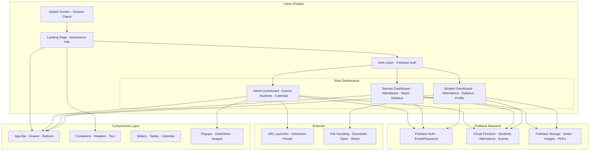

<div align="center">
  <picture>
    <source media="(prefers-color-scheme: dark)" srcset="https://raw.githubusercontent.com/Aicodebyprince/College-Management-App/main/assets/rmc_logo.png">
    
  </picture>

  <h1>RMC — College Management App</h1>

  **Flutter + Firebase** · Multi-role academic management system  
  `Built for Reena Mehta College, University of Mumbai`

  <br/>

  [Report Bug](https://github.com/Aicodebyprince/College-Management-App/issues) · [Request Feature](https://github.com/Aicodebyprince/College-Management-App/issues)

</div>

---

<br/>

## The Problem

College administration involves a constellation of disconnected workflows — attendance registers, notice boards, syllabus distribution, timetable changes, event announcements, academic calendars, and fee records. Each workflow lives in its own spreadsheet, paper register, or WhatsApp group. The result: information fragmentation, manual duplication, and a coordination tax that compounds across every role in the institution.

This app consolidates those workflows into a **single mobile interface** with role-specific views, real-time data sync, and a unified authentication layer.

---

## The Solution

A **Flutter + Firebase** mobile application serving four distinct user roles — Admin, Teacher, Student, and Visitor — each with a tailored dashboard, permissions, and feature set. The architecture follows a component-based Flutter pattern with Firebase as the backend substrate: Auth for identity, Firestore for real-time data, and Storage for file distribution.



---

## Role-Based Features

### 🧑‍💼 Admin

| Feature | Implementation |
|---------|---------------|
| **Event Management** | CRUD operations on Firestore `events` collection with gradient app bar, multi-select deletion |
| **Student Directory** | Filterable student lists by stream (BSC IT, BSC Data Science) and year (FY, SY, TY) with real-time search |
| **Teacher Management** | Add/manage teacher accounts from the admin panel |
| **Academic Calendar** | Calendar view of important academic dates and events |
| **Student Details** | Drill-down view with roll number, email, stream, and year |
| **Dashboard Analytics** | Overview of college events with FAB-based event creation |

### 🧑‍🏫 Teacher

| Feature | Implementation |
|---------|---------------|
| **Attendance Marking** | Practical/theory attendance with Firebase persistence and percentage calculation |
| **Notes Upload** | Image-based study material upload to Firebase Storage with stream/year organization |
| **Syllabus Management** | Upload and manage syllabus documents with Firebase Storage integration |
| **Student Management** | Add new students, view existing ones by stream/year, role-based access |
| **Event Dashboard** | View college events with read-only access |
| **Expandable FAB Menu** | Animated radial menu for quick access to attendance, notes, and syllabus actions |
| **Class Timetables** | Manage and view class schedules with Firestore sync |

### 🧑‍🎓 Student

| Feature | Implementation |
|---------|---------------|
| **Attendance Dashboard** | Practical vs theory breakdown with percentage progress indicators |
| **Syllabus Viewer** | Stream/year-based syllabus browsing with Firebase data |
| **Notes Downloader** | Download study materials with permission handling and file opening |
| **Profile View** | Personal details fetched from Firestore `students` collection |
| **College Events** | Read-only event list with pull-to-refresh |
| **Academic Calendar** | Student-facing calendar view |
| **Timetable** | Personal class schedule with stream/year filtering |
| **Bottom Navigation** | 4-tab navigation: Home, Attendance, Syllabus, Profile |

### 👀 Visitor (Landing Page)

| Feature | Implementation |
|---------|---------------|
| **Admissions Information** | Comprehensive admission links for FYJC, UG, and PG programs |
| **Course Catalog** | Program listings: B.COM, B.A., B.SC., B.M.S., B.A.F., B.B.I., B.A.M.M.C., BSc IT, BSc Data Science, BSc Hospitality Studies |
| **Institutional Info** | About Us, Facilities, Library, Code of Conduct, Alumni, Placement |
| **Committees** | NSS Unit, IQAC, Examination Committee, Women Cell, Alumni Committee |
| **Auto-Sliding Carousel** | Image slider for college announcements and highlights |
| **University Portals** | Direct links to Mumbai University UG and PG admission portals |
| **Registration** | New user registration flow |

---

## Architecture

### File Structure

```
lib/
├── main.dart                          # Entry point, splash screen, role routing
│
├── components/                        # 14 reusable UI components
│   ├── app_bar.dart                   #   consistent app bar across screens
│   ├── drawer.dart                    #   navigation drawer
│   ├── auto_sliding_page_view.dart    #   image carousel for landing page
│   ├── big_container.dart             #   large content container
│   ├── button.dart                    #   reusable button with URL launch
│   ├── header_title.dart              #   section headers with underline
│   ├── image_title.dart               #   image + title combos
│   ├── small_container.dart           #   compact content cards
│   ├── small_text.dart                #   standardized typography
│   ├── table.dart                     #   data tables
│   ├── underline.dart                 #   visual dividers
│   ├── underlined_text.dart           #   text with underline
│   ├── popup_content.dart             #   modal content
│   └── academic_calendar.dart         #   calendar widget
│
├── pages/                             # 25+ informational pages
│   ├── about_us.dart                  #   college information
│   ├── nss_unit.dart                  #   NSS committee details
│   ├── iqac_committee.dart            #   IQAC information
│   ├── library.dart                   #   library resources
│   ├── placement.dart                 #   placement cell
│   ├── facilities.dart                #   campus facilities
│   ├── examination_scheme.dart        #   exam structure
│   ├── merit_lists.dart               #   merit rankings
│   ├── alumni_committee.dart          #   alumni info
│   ├── feedback_forms.dart            #   student feedback
│   ├── skill_development_program.dart #   skill programs
│   ├── code_of_conduct.dart           #   conduct policy
│   ├── student_satisfaction_survey.dart#  survey data
│   ├── rti.dart                       #   RTI information
│   └── ...                            #   more pages
│
├── landing_page.dart                  # Visitor-facing admissions hub
├── loginpage.dart                     # Authentication screen
├── forget_pass.dart                   # Password recovery
│
├── admindashboard.dart                # Admin panel with event CRUD
├── teacherpage.dart                   # Teacher panel with attendance + notes
├── studentdashboard.dart              # Student panel with 4-tab navigation
│
├── addstudent.dart                    # Student registration form
├── student.dart                       # Student data model
├── studenttimetable.dart              # Student schedule view
│
├── syllabus.dart                      # Syllabus viewer
├── teachernotes.dart                  # Notes upload interface
├── teacherpage.dart                   # Teacher profile + schedule
│
├── timetable.dart                     # Timetable management
├── academic_calendar.dart             # Admin calendar
├── academic_student_calendar.dart     # Student calendar
│
├── bscDS_FY.dart                      # BSC Data Science FY syllabus
├── bscDS_SY.dart                      # BSC Data Science SY syllabus
├── bscDS_TY.dart                      # BSC Data Science TY syllabus
├── bscitsy.dart                       # BSC IT SY syllabus
└── bscitty.dart                       # BSC IT TY syllabus
```

### Data Flow

```
User Action → Flutter Widget → Firebase SDK → Firestore/Storage → Real-time UI Update
     │                                                  │
     └── SharedPreferences (session persistence) ───────┘
```

- **Authentication**: Firebase Auth with email/password, session persisted via `SharedPreferences` with 5-day expiry
- **Database**: Cloud Firestore with collections: `students`, `events`, `attendance`, `teachers`
- **Storage**: Firebase Storage for notes images, syllabus PDFs, profile assets
- **Real-time**: `StreamBuilder` + `snapshots()` for live attendance and event data

---

## Tech Stack

| Category | Technology | Purpose |
|----------|-----------|---------|
| **Framework** | [Flutter](https://flutter.dev/) (3.22.1) | Cross-platform mobile UI |
| **Language** | [Dart](https://dart.dev/) (3.7) | Type-safe application logic |
| **Auth** | [Firebase Auth](https://firebase.google.com/docs/auth) | Email/password authentication |
| **Database** | [Cloud Firestore](https://firebase.google.com/docs/firestore) | Real-time NoSQL data store |
| **Storage** | [Firebase Storage](https://firebase.google.com/docs/storage) | File uploads (notes, images) |
| **Charts** | [fl_chart](https://pub.dev/packages/fl_chart) | Attendance visualizations |
| **Calendar** | [table_calendar](https://pub.dev/packages/table_calendar) | Academic calendar views |
| **Image** | [photo_view](https://pub.dev/packages/photo_view) | Full-screen image viewing |
| **Network** | [dio](https://pub.dev/packages/dio) | HTTP file downloads |
| **Files** | [open_file](https://pub.dev/packages/open_file) | Open downloaded documents |
| **Permissions** | [permission_handler](https://pub.dev/packages/permission_handler) | Runtime permission management |
| **Downloads** | [flutter_downloader](https://pub.dev/packages/flutter_downloader) | Background file downloads |
| **URLs** | [url_launcher](https://pub.dev/packages/url_launcher) | External portal navigation |
| **Video** | [video_player](https://pub.dev/packages/video_player) | Video playback |
| **Pickers** | [image_picker](https://pub.dev/packages/image_picker) / [file_picker](https://pub.dev/packages/file_picker) | Media selection |
| **Session** | [shared_preferences](https://pub.dev/packages/shared_preferences) | Local session persistence |
| **Typography** | [google_fonts](https://pub.dev/packages/google_fonts) | Custom fonts |
| **Dates** | [intl](https://pub.dev/packages/intl) | Date formatting and localization |
| **Icons** | [remixicon](https://pub.dev/packages/remixicon) / [cupertino_icons](https://pub.dev/packages/cupertino_icons) | Icon system |

---

## Getting Started

### Prerequisites

| Requirement | Version |
|-------------|---------|
| Flutter SDK | [Install guide](https://docs.flutter.dev/get-started/install) |
| Dart SDK | Bundled with Flutter |
| Firebase Project | With Auth + Firestore + Storage enabled |
| Android Studio / VS Code | Flutter development |

### Setup

```bash
# Clone the repository
git clone https://github.com/Aicodebyprince/College-Management-App.git
cd College-Management-App

# Install dependencies
flutter pub get

# Run the app
flutter run
```

### Firebase Configuration

1. Go to [Firebase Console](https://console.firebase.google.com/)
2. Create a new project (or use existing)
3. Enable **Firebase Auth** → Email/Password sign-in
4. Enable **Cloud Firestore** → Start in test mode
5. Enable **Firebase Storage** → Configure rules
6. Register an **Android app** and download `google-services.json` into `android/app/`
7. Register an **iOS app** (if targeting iOS) and download `GoogleService-Info.plist`

---

## Project Values

```
Maintainability     ████████████████████████████░░  14 reusable components
Coverage            ██████████████████████████████  4 roles · 30+ screens
Real-time           ██████████████████████████████  Firestore live sync
Offline persistence ████████████████░░░░░░░░░░░░░░  SharedPreferences sessions
Accessibility       ██████████████████░░░░░░░░░░░░  Role-based navigation
```

---

## Contributors

| Name | Role |
|------|------|
| **Prince Vipul Sherathiya** | Developer |
| **Shivam Shashikant Marolikar** | Developer |
| **Prof. Ashok Yadav** | Guidance |

**Institution:** Reena Mehta College, University of Mumbai

---

## License

Distributed under the **MIT License**. See `LICENSE` for more information.

---

<div align="center">
  <small>Built with Flutter & Firebase by <strong>Prince Sherathiya</strong> — <a href="https://webturnerai.tech/">WebTurnerAI</a></small>
  <br/>
  <small>&copy; 2026</small>
</div>
